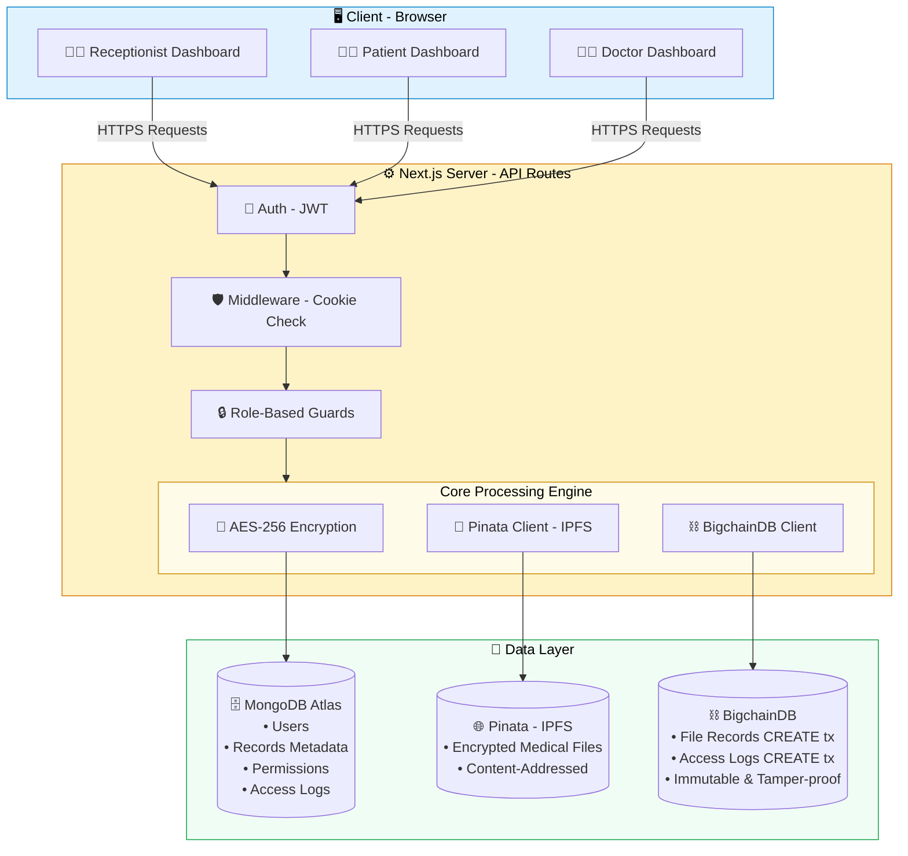
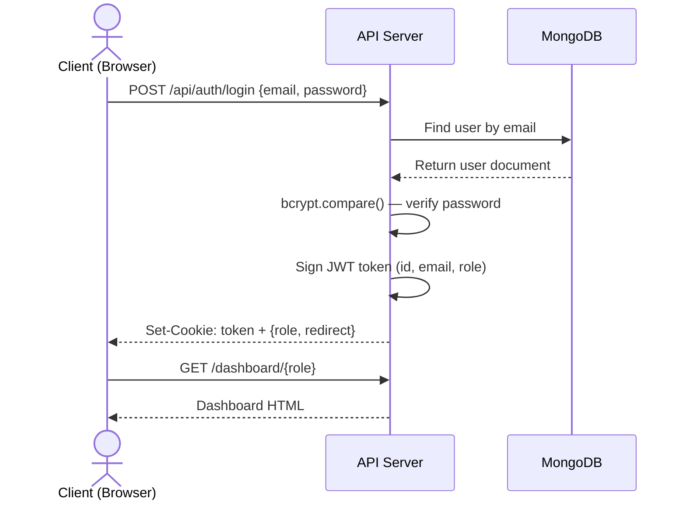
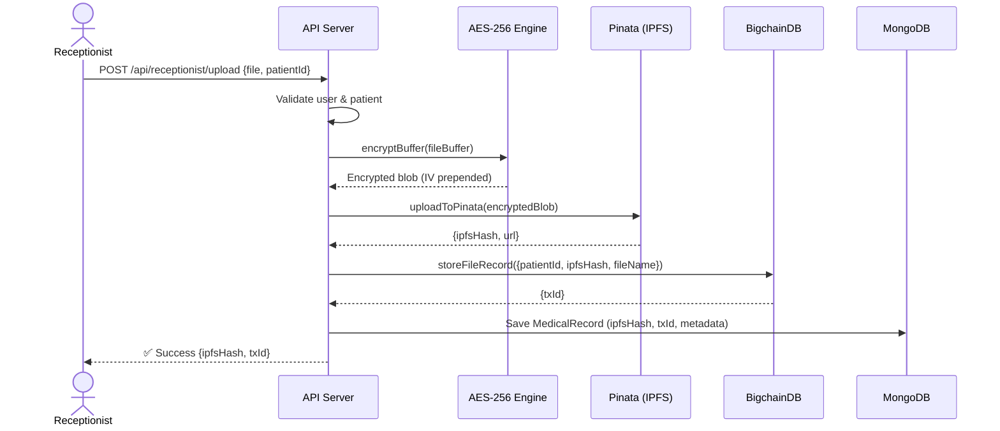
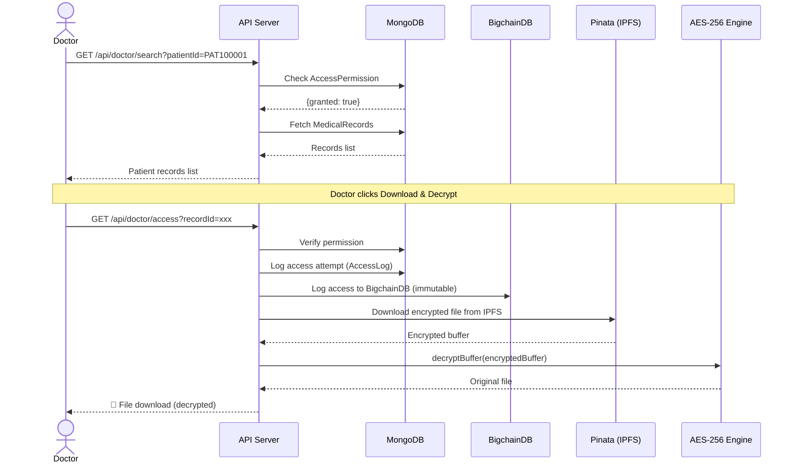
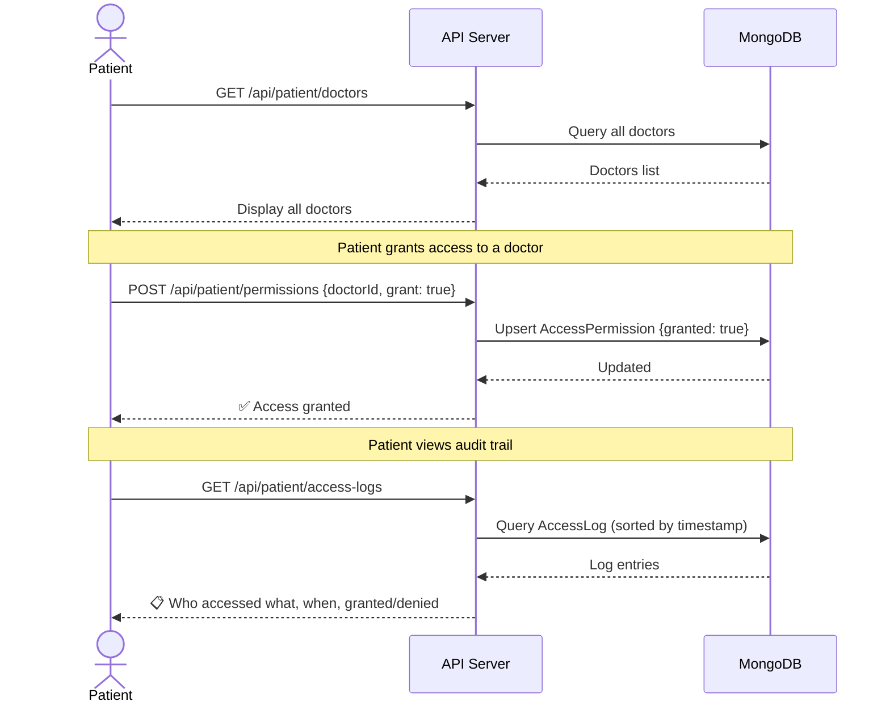
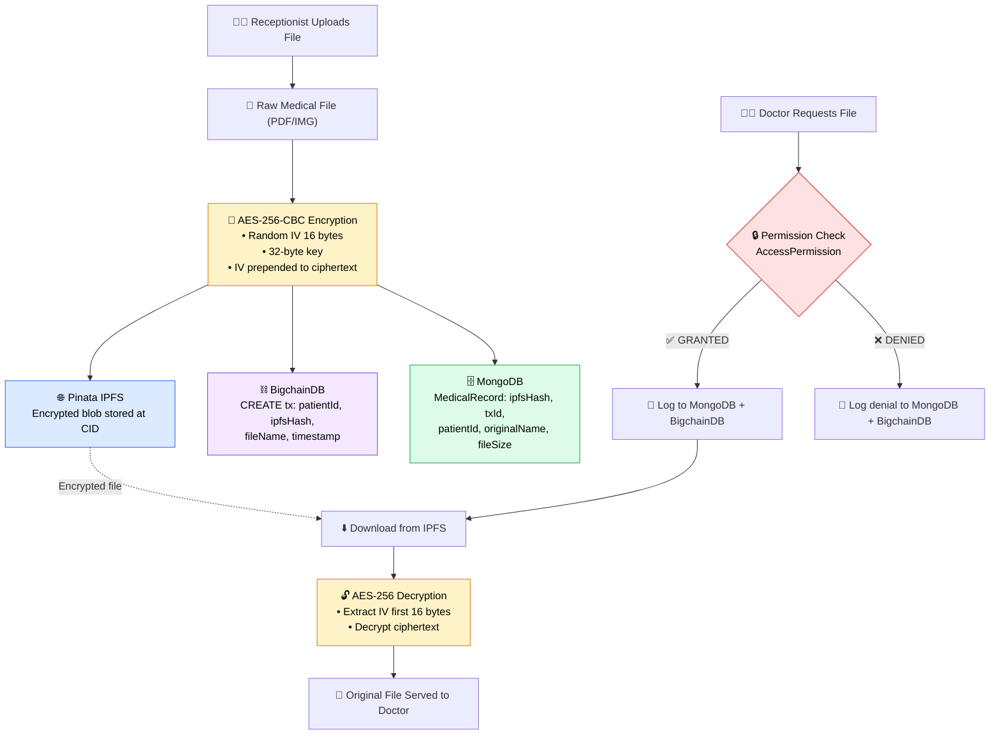
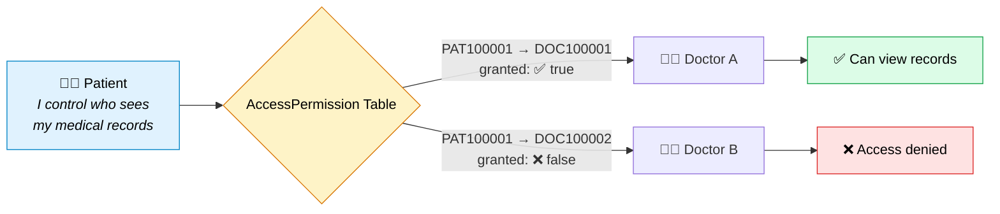
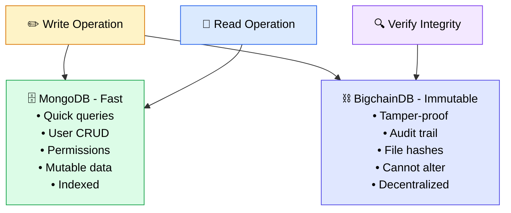
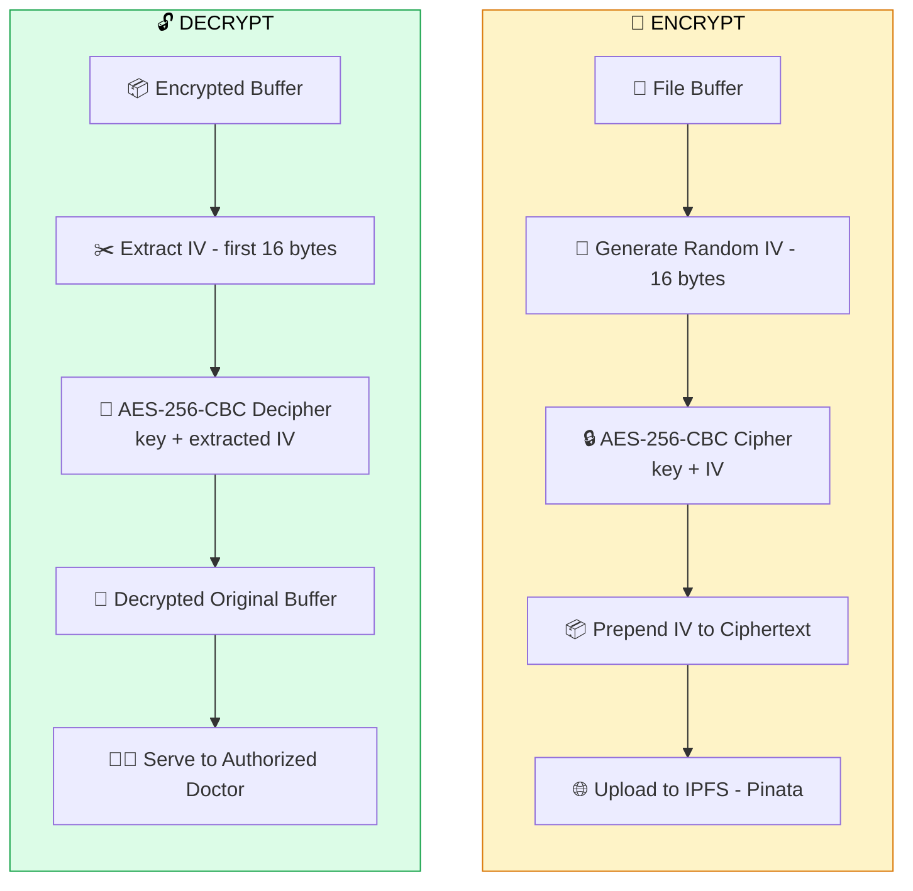

# 🏥 MedChain — Blockchain-Based Medical Record Storage

> **AES-256 Encrypted Medical Records on IPFS & BigchainDB**

A decentralized medical record management system that ensures **data integrity**, **patient privacy**, and **immutable audit trails** using blockchain technology. Built as a full-stack application with role-based access control for Receptionists, Doctors, and Patients.

---

## 📑 Table of Contents

- [Features](#-features)
- [Tech Stack](#-tech-stack)
- [System Architecture](#-system-architecture)
- [Sequence Diagrams](#-sequence-diagrams)
- [Data Flow Diagrams](#-data-flow-diagrams)
- [Project Structure](#-project-structure)
- [Database Schema](#-database-schema)
- [API Reference](#-api-reference)
- [Prerequisites](#-prerequisites)
- [Installation & Setup](#-installation--setup)
- [Environment Variables](#-environment-variables)
- [Running the Application](#-running-the-application)
- [Demo Credentials](#-demo-credentials)
- [Security Features](#-security-features)

---

## ✨ Features

| Role | Capabilities |
|---|---|
| **Receptionist** | Register doctors & patients, upload encrypted medical records |
| **Patient** | View own records, manage doctor access permissions, view audit logs |
| **Doctor** | Search patient records, download & decrypt files (if access granted) |

**Core Highlights:**

- 🔐 **AES-256-CBC Encryption** — Files encrypted before leaving the server
- 🌐 **IPFS Storage** — Decentralized file storage via Pinata
- ⛓️ **BigchainDB** — Immutable record & audit trail on blockchain
- 🗄️ **MongoDB** — Fast queries, user management, access control
- 🔑 **JWT Authentication** — Secure HTTP-only cookie sessions
- 🛡️ **Role-Based Access** — Three distinct user roles with granular permissions
- 📋 **Immutable Audit Logs** — Every access attempt recorded on blockchain

---

## 🧰 Tech Stack

```
┌──────────────────────────────────────────────────────┐
│                    FRONTEND                          │
│  Next.js 14 (App Router) · React 18 · TypeScript    │
│  Tailwind CSS · react-hot-toast · react-icons        │
├──────────────────────────────────────────────────────┤
│                   BACKEND (API)                      │
│  Next.js API Routes · JWT Auth · bcryptjs            │
│  Node.js Crypto (AES-256-CBC)                        │
├──────────────────────────────────────────────────────┤
│                   DATA LAYER                         │
│  MongoDB (Mongoose) · BigchainDB · Pinata (IPFS)     │
└──────────────────────────────────────────────────────┘
```

| Layer | Technology | Purpose |
|---|---|---|
| Frontend | Next.js 14, React 18, Tailwind CSS | UI & routing |
| Backend | Next.js API Routes, TypeScript | REST API endpoints |
| Database | MongoDB Atlas (Mongoose ODM) | User data, records metadata, permissions |
| Blockchain | BigchainDB | Immutable file records & audit trail |
| File Storage | IPFS via Pinata | Decentralized encrypted file storage |
| Encryption | AES-256-CBC (Node.js `crypto`) | File encryption/decryption |
| Authentication | JWT + bcryptjs | Stateless auth with password hashing |

---

## 🏗️ System Architecture



### Architecture Overview

1. **Client Layer** — Role-specific React dashboards communicating via REST APIs
2. **Server Layer** — Next.js API routes handling auth, encryption, and orchestration
3. **Data Layer** — Triple storage strategy:
   - **MongoDB** for fast queries (users, metadata, permissions)
   - **IPFS/Pinata** for decentralized encrypted file storage
   - **BigchainDB** for immutable records and audit trails

---

## 🔄 Sequence Diagrams

### 1. User Authentication Flow



### 2. Medical Record Upload Flow (Receptionist)



### 3. Doctor Accessing Patient Records



### 4. Patient Managing Access Permissions



---

## 📊 Data Flow Diagrams

### End-to-End File Lifecycle



### Access Control Model



### Blockchain Dual-Write Strategy



---

## 📁 Project Structure

```
blockchain-fileview/
├── public/
│   └── favicon.svg                   # App favicon
├── src/
│   ├── app/
│   │   ├── api/
│   │   │   ├── auth/
│   │   │   │   ├── login/route.ts          # POST — User login
│   │   │   │   ├── logout/route.ts         # POST — Clear session
│   │   │   │   ├── me/route.ts             # GET  — Current user info
│   │   │   │   └── change-password/route.ts# POST — Update password
│   │   │   ├── receptionist/
│   │   │   │   ├── register/route.ts       # POST — Register doctor/patient
│   │   │   │   ├── upload/route.ts         # POST — Encrypt & upload file
│   │   │   │   └── users/route.ts          # GET  — List all users
│   │   │   ├── patient/
│   │   │   │   ├── records/route.ts        # GET  — Patient's own records
│   │   │   │   ├── doctors/route.ts        # GET  — List all doctors
│   │   │   │   ├── permissions/route.ts    # GET/POST — Manage access
│   │   │   │   └── access-logs/route.ts    # GET  — View audit trail
│   │   │   └── doctor/
│   │   │       ├── patients/route.ts       # GET  — List all patients
│   │   │       ├── search/route.ts         # GET  — Search patient records
│   │   │       └── access/route.ts         # GET  — Download & decrypt file
│   │   ├── dashboard/
│   │   │   ├── receptionist/page.tsx       # Receptionist dashboard
│   │   │   ├── patient/page.tsx            # Patient dashboard
│   │   │   └── doctor/page.tsx             # Doctor dashboard
│   │   ├── page.tsx                        # Login page
│   │   ├── layout.tsx                      # Root layout + metadata
│   │   └── globals.css                     # Global Tailwind styles
│   ├── components/
│   │   └── Navbar.tsx                      # Shared navigation bar
│   ├── lib/
│   │   ├── auth.ts                         # JWT sign / verify / getAuthUser
│   │   ├── mongodb.ts                      # Mongoose connection singleton
│   │   ├── encryption.ts                   # AES-256-CBC encrypt / decrypt
│   │   ├── pinata.ts                       # IPFS upload / download via Pinata
│   │   └── bigchaindb.ts                   # BigchainDB client & helpers
│   ├── models/
│   │   ├── User.ts                         # User schema (roles, IDs)
│   │   ├── MedicalRecord.ts               # Encrypted file metadata
│   │   ├── AccessPermission.ts            # Doctor ↔ Patient permissions
│   │   └── AccessLog.ts                   # Access audit log entries
│   ├── scripts/
│   │   └── seed.ts                         # Database seeding script
│   └── types/
│       └── bigchaindb-driver.d.ts         # BigchainDB type declarations
├── .env.local                              # Environment variables
├── .gitignore
├── middleware.ts → src/middleware.ts        # Route protection
├── next.config.js
├── package.json
├── postcss.config.js
├── tailwind.config.ts
├── tsconfig.json
└── tsconfig.seed.json                      # Config for seed script
```

---

## 🗃️ Database Schema

### MongoDB Collections

#### Users
| Field | Type | Description |
|---|---|---|
| `_id` | ObjectId | Auto-generated |
| `name` | String | Full name |
| `email` | String (unique) | Login email |
| `password` | String | bcrypt hash |
| `role` | Enum | `receptionist` / `doctor` / `patient` |
| `patientId` | String | e.g., `PAT100001` (patients only) |
| `doctorId` | String | e.g., `DOC100001` (doctors only) |
| `specialization` | String | Medical specialization (doctors only) |
| `phone` | String | Contact number |
| `createdAt` | DateTime | Auto timestamp |

#### MedicalRecords
| Field | Type | Description |
|---|---|---|
| `_id` | ObjectId | Auto-generated |
| `patientId` | String (indexed) | Owner patient's ID |
| `patientName` | String | Patient's name |
| `fileName` | String | Stored file name |
| `originalName` | String | Original upload name |
| `ipfsHash` | String | Pinata CID (content address) |
| `bigchainTxId` | String | BigchainDB transaction ID |
| `uploadedBy` | ObjectId | Receptionist who uploaded |
| `fileSize` | Number | File size in bytes |
| `mimeType` | String | File MIME type |
| `createdAt` | DateTime | Upload timestamp |

#### AccessPermissions
| Field | Type | Description |
|---|---|---|
| `patientId` | String | Patient granting access |
| `doctorId` | String | Doctor receiving access |
| `granted` | Boolean | Current permission state |
| `grantedAt` | DateTime | When access was granted |
| `revokedAt` | DateTime | When access was revoked (nullable) |
| *Unique Index* | | `(patientId, doctorId)` compound |

#### AccessLogs
| Field | Type | Description |
|---|---|---|
| `patientId` | String (indexed) | Whose record was accessed |
| `doctorId` | String | Who accessed it |
| `doctorName` | String | Doctor's display name |
| `fileName` | String | Which file was accessed |
| `ipfsHash` | String | IPFS hash of the file |
| `accessGranted` | Boolean | Was access successful? |
| `timestamp` | DateTime | When the attempt occurred |

### BigchainDB Assets

**File Record** (created on upload):
```json
{
  "type": "medical_record",
  "patientId": "PAT100001",
  "ipfsHash": "QmXnnyufdzAW...",
  "fileName": "blood_report.pdf",
  "uploadedBy": "receptionist@medchain.com",
  "timestamp": "2026-02-18T10:30:00.000Z"
}
```

**Access Log** (created on every access attempt):
```json
{
  "type": "access_log",
  "patientId": "PAT100001",
  "doctorId": "DOC100001",
  "doctorName": "Dr. Smith",
  "fileName": "blood_report.pdf",
  "accessGranted": true,
  "timestamp": "2026-02-18T11:00:00.000Z"
}
```

---

## 📡 API Reference

### Authentication

| Method | Endpoint | Body | Description |
|--------|----------|------|-------------|
| `POST` | `/api/auth/login` | `{email, password}` | Login & set JWT cookie |
| `POST` | `/api/auth/logout` | — | Clear JWT cookie |
| `GET` | `/api/auth/me` | — | Get current user info |
| `POST` | `/api/auth/change-password` | `{currentPassword, newPassword}` | Change password |

### Receptionist Routes *(role: receptionist)*

| Method | Endpoint | Body / Query | Description |
|--------|----------|------------|-------------|
| `POST` | `/api/receptionist/register` | `{name, email, password, role, specialization?, phone?}` | Register doctor or patient |
| `POST` | `/api/receptionist/upload` | `FormData: {file, patientId}` | Encrypt → IPFS → Blockchain → MongoDB |
| `GET` | `/api/receptionist/users` | `?role=doctor\|patient` | List registered users |

### Patient Routes *(role: patient)*

| Method | Endpoint | Body / Query | Description |
|--------|----------|------------|-------------|
| `GET` | `/api/patient/records` | — | Get own medical records |
| `GET` | `/api/patient/doctors` | — | List all registered doctors |
| `GET` | `/api/patient/permissions` | — | Get current permission settings |
| `POST` | `/api/patient/permissions` | `{doctorId, grant: boolean}` | Grant or revoke doctor access |
| `GET` | `/api/patient/access-logs` | — | View audit trail |

### Doctor Routes *(role: doctor)*

| Method | Endpoint | Body / Query | Description |
|--------|----------|------------|-------------|
| `GET` | `/api/doctor/patients` | — | List all registered patients |
| `GET` | `/api/doctor/search` | `?patientId=PAT100001` | Search patient records (if access granted) |
| `GET` | `/api/doctor/access` | `?recordId=<mongoId>` | Download & decrypt a medical record |

---

## 📋 Prerequisites

| Requirement | Version | Purpose |
|---|---|---|
| **Node.js** | ≥ 18.x | Runtime |
| **npm** | ≥ 9.x | Package manager |
| **Docker** | Latest | Run BigchainDB container |
| **MongoDB Atlas** | Cloud (free tier) | Database |
| **Pinata Account** | Free tier | IPFS file storage |

---

## 🚀 Installation & Setup

### 1. Clone the Repository

```bash
git clone <repository-url>
cd blockchain-fileview
```

### 2. Install Dependencies

```bash
npm install
```

### 3. Start BigchainDB (Docker)

```bash
docker pull bigchaindb/bigchaindb:all-in-one

docker run \
  --detach \
  --name bigchaindb \
  --publish 9984:9984 \
  --publish 9985:9985 \
  --publish 26657:26657 \
  bigchaindb/bigchaindb:all-in-one
```

Verify it's running:
```bash
curl http://localhost:9984/api/v1/
```

### 4. Setup MongoDB Atlas

1. Go to [MongoDB Atlas](https://www.mongodb.com/atlas) → Create free cluster
2. Create a database user with read/write permissions
3. Whitelist your IP address (or `0.0.0.0/0` for development)
4. Copy the connection string

### 5. Setup Pinata (IPFS)

1. Go to [Pinata](https://pinata.cloud) → Create free account
2. Navigate to API Keys → Generate new key pair
3. Copy both `API Key` and `API Secret`

### 6. Configure Environment Variables

Create `.env.local` in the project root:

```env
MONGODB_URI=mongodb+srv://<user>:<password>@<cluster>.mongodb.net/medical-records
JWT_SECRET=your-secret-key-minimum-32-characters
AES_ENCRYPTION_KEY=<64-character-hex-string>
BIGCHAINDB_URL=http://localhost:9984/api/v1/
PINATA_API_KEY=your-pinata-api-key
PINATA_SECRET_KEY=your-pinata-secret-key
PINATA_GATEWAY=https://gateway.pinata.cloud/ipfs
```

Generate an AES encryption key:
```bash
node -e "console.log(require('crypto').randomBytes(32).toString('hex'))"
```

### 7. Seed the Database

```bash
npx ts-node --project tsconfig.seed.json src/scripts/seed.ts
```

Creates three demo users (see [Demo Credentials](#-demo-credentials)).

---

## ▶️ Running the Application

**Development:**
```bash
npm run dev
```
Open **http://localhost:3000**

**Production:**
```bash
npm run build
npm start
```

---

## 🔑 Demo Credentials

| Role | Email | Password | ID |
|---|---|---|---|
| Receptionist | `receptionist@medchain.com` | `password123` | — |
| Doctor | `doctor@medchain.com` | `password123` | `DOC100001` |
| Patient | `patient@medchain.com` | `password123` | `PAT100001` |

---

## 🛡️ Security Features

| Feature | Implementation |
|---|---|
| **File Encryption** | AES-256-CBC with random IV per file; key stored server-side only |
| **Password Hashing** | bcryptjs with 12 salt rounds |
| **JWT Tokens** | HTTP-only cookies (XSS-safe), 8-hour expiry |
| **Role-Based Access** | API-level guards verify role before every request |
| **Patient Consent** | Doctors cannot access records without explicit patient grant |
| **Immutable Audit** | Every access attempt logged on BigchainDB — cannot be altered or deleted |
| **Decentralized Storage** | Files stored on IPFS — no single point of failure |
| **Middleware Protection** | All `/dashboard/*` routes require valid session cookie |

### Encryption Detail



---

## 📜 License

This project was built as a college project demonstrating blockchain-based medical record management with AES-256 encryption.

---

<p align="center">
  Built with ❤️ using Next.js · BigchainDB · MongoDB · IPFS
</p>
